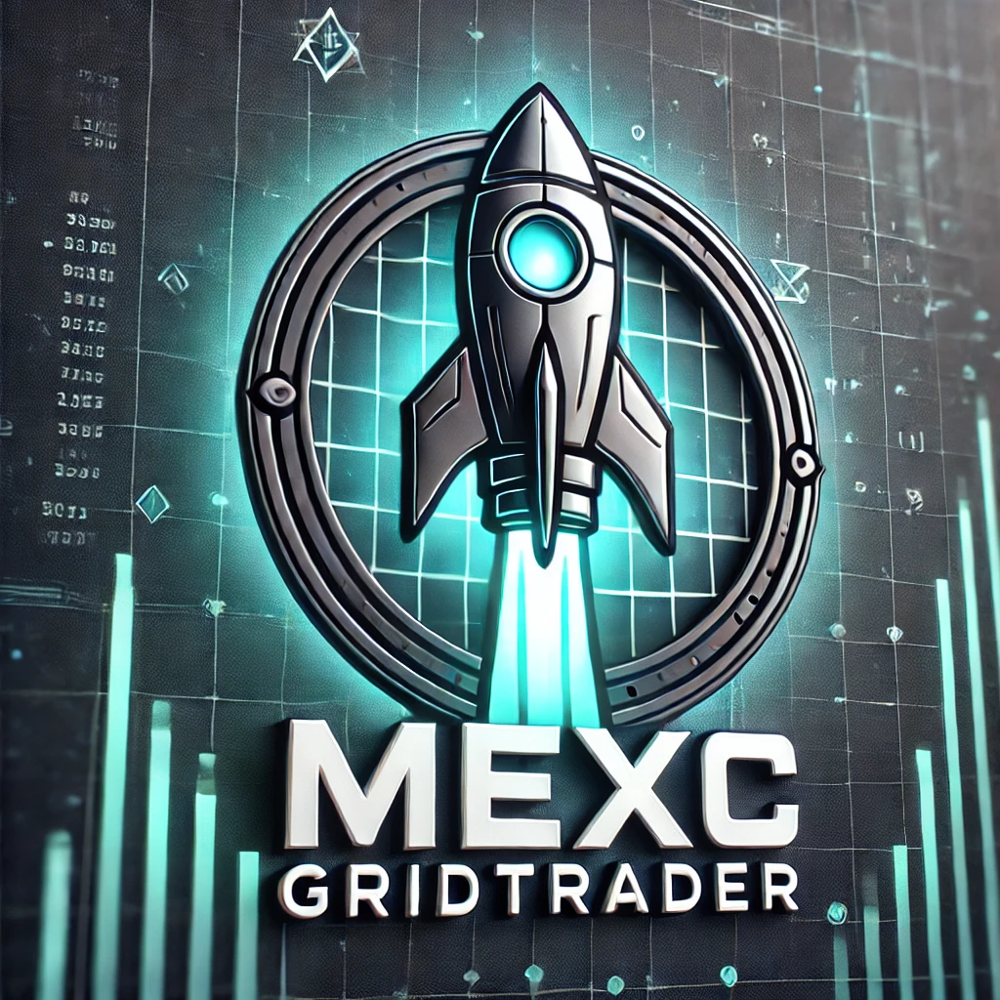
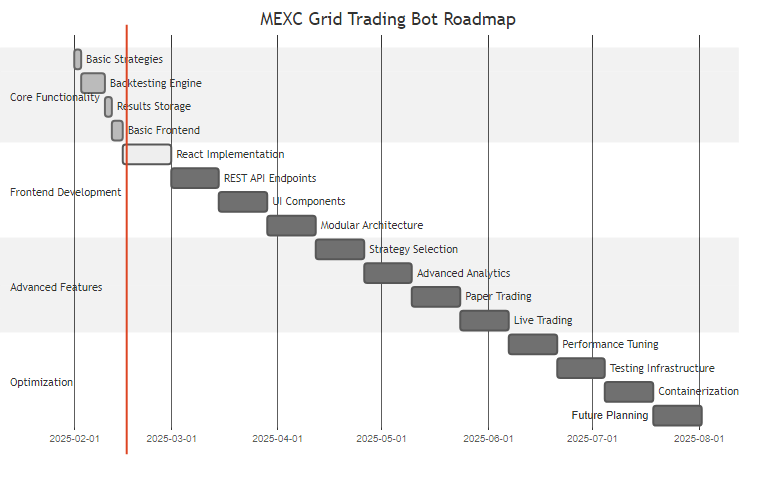

<!-- HEADER SECTION -->
<div align="center">

  <!-- LOGO -->
  

  <!-- PROJECT TITLE -->
  <h1>MEXC GridTrader 🚀</h1>

  <!-- PROJECT DESCRIPTION -->
  <p>
    <strong>MEXC GridTrader</strong> is an algorithmic trading bot for <strong>dynamic grid trading</strong> on <strong>MEXC Exchange</strong>, featuring <strong>backtesting</strong>, <strong>performance analysis</strong>, and <strong>strategy optimization</strong>. It includes <strong>historical data caching</strong>, <strong>trade simulations</strong>, and an interactive <strong>web interface</strong> for running and reviewing backtests.
  </p>

  

</div>

## Current Status
**Version 0.4.0** - The core functionality is complete and the system is stable for backtesting. We're currently working on advanced analytics and UI enhancements.

## Key Features
- **Backtesting Framework** - Simulate grid strategies on historical data with detailed trade logs
- **Interactive Charts** - View price movements and trade executions with candlestick charts (only in backend template yet)
- **Trade Analysis** - Automatic calculation of performance metrics (profit, drawdown, Sharpe ratio)
- **OHLCV Data Caching** - Efficiently fetch and store candle data, reducing API usage (theres a limit of 500 candles for mexc exchange so maybe prep yourself with some historical data for more stable/accurate results)
- **Dynamic Strategy Selection** - Choose between grid and momentum strategies (currently momentum strategy is active for frontend, a selection ui component will follow so it can be dynamically swapped)
- **Responsive Design** - Optimized for desktop and mobile devices (cap)
- **Containerized Deployment** - Easy setup with Docker and Docker Compose (not tested yet, will do when frontend-react-app is ready)

## Recent Enhancements
- Added (hardcoded) strategy selection checks into backend logic
- Implemented responsive design across all pages
- Enhanced chart visualization with volume overlay
- Improved parameter organization and tooltips
- Added backtest management features (renaming, notes, archiving)

## Getting Started

1. **Clone the Repo**  
   ```bash
   git clone https://github.com/YourUsername/mexc-gridtrader.git
   cd mexc-gridtrader
   ```

2. **Install Poetry** *(dependency management)*
   ```bash
   pip install poetry
   ```

3. **Install Dependencies**  
   ```bash
   poetry install
   ```

4. **Configure Environment**  
   - Create a `.env` file (copy from `.env.example`) and fill in your MEXC API keys.  
   - Check or adjust settings (like `FLASK_DEBUG` or `LOG_LEVEL`) to your preference.

5. **Run with Docker Compose** *(recommended)*
   ```bash
   docker-compose up --build
   ```
   Access the app at:
   - Backend: http://localhost:5000
   - Frontend: http://localhost:3000

## Development Roadmap


For detailed information about our development plans and progress, see the [Project Roadmap](docs/ROADMAP.md)

## Current Tasks and Todos
For a comprehensive list of tasks and todos, see the [Project Tasks](docs/TODO.md)

## Changelog
For a detailed history of changes, see the [Changelog](docs/CHANGELOG.md)

## Contributing
We welcome contributions via Pull Requests. Please open an Issue first to discuss changes or features.

---

**MEXC GridTrader** is actively maintained and evolving. Stay tuned for further updates, and feel free to submit feature requests or bug reports!

<p align="center">
  <a href="https://github.com/imKXNNY">
    
  </a>
  <p align="center">Happy Trading!</p>
</p>
