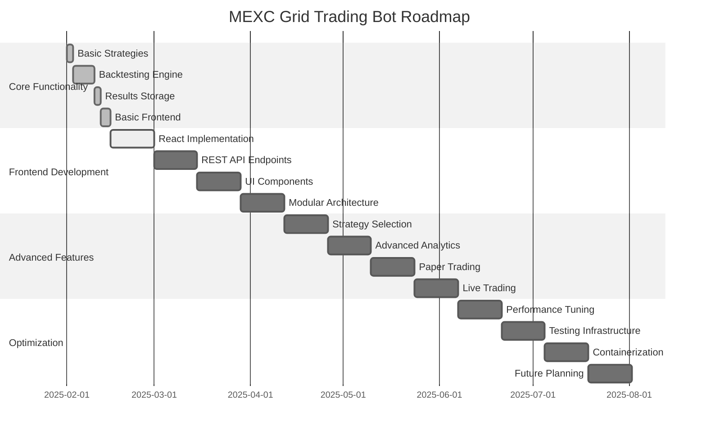

# MEXC Grid Trading Bot – Visual Roadmap

```mermaid
%%{init: {'theme': 'neutral', 'themeVariables': {
  'primaryColor': '#f2f2f2',
  'primaryTextColor': '#333333',
  'primaryBorderColor': '#cccccc',
  'secondaryColor': '#e6e6e6',
  'tertiaryColor': '#ffffff',
  'lineColor': '#666666',
  'textColor': '#333333',
  'fontSize': '14px',
  'fontFamily': 'Arial'
}}}%%

gantt
    title MEXC Grid Trading Bot Roadmap
    dateFormat  YYYY-MM-DD

    section Core Functionality
    Basic Strategies         :done,    des1, 2025-02-01, 2025-02-03
    Backtesting Engine       :done,    des2, 2025-02-03, 2025-02-10
    Results Storage          :done,    des3, 2025-02-10, 2025-02-12
    Basic Frontend           :done,    des4, 2025-02-12, 2025-02-15

    section Frontend Development
    React Implementation     :active,  des5, 2025-02-15, 2025-03-01
    REST API Endpoints       :         des6, 2025-03-01, 2025-03-15
    UI Components            :         des7, 2025-03-15, 2025-03-29
    Modular Architecture     :         des8, 2025-03-29, 2025-04-12

    section Advanced Features
    Strategy Selection       :         des9, 2025-04-12, 2025-04-26
    Advanced Analytics       :         des10, 2025-04-26, 2025-05-10
    Paper Trading            :         des11, 2025-05-10, 2025-05-24
    Live Trading             :         des12, 2025-05-24, 2025-06-07

    section Optimization
    Performance Tuning       :         des13, 2025-06-07, 2025-06-21
    Testing Infrastructure   :         des14, 2025-06-21, 2025-07-05
    Containerization         :         des15, 2025-07-05, 2025-07-19
    Future Planning          :         des16, 2025-07-19, 2025-08-02
```